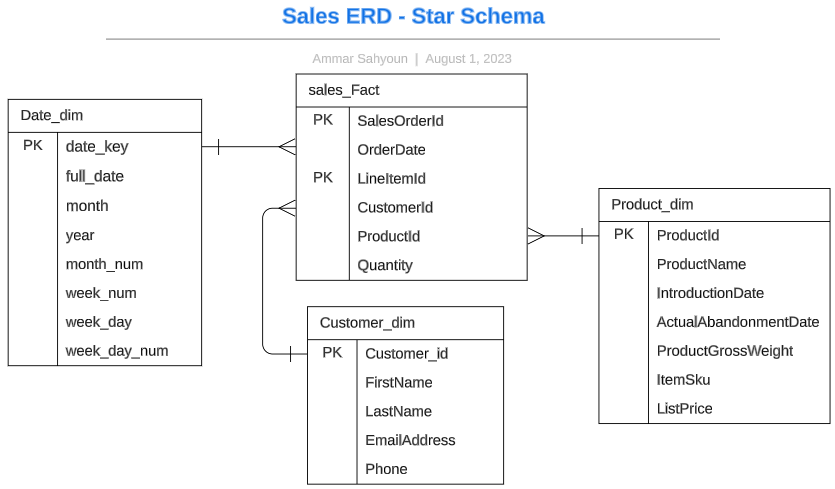

### This is an OLAP system from a data warehouse, contains all the transactions for one day.
### With a composite primary key in the fact table that consist of (orderId, ItemId)
 

this repo contain:
* TSQL queries that define the star schema.
* Generate dimension date table by TSQL.
* ad-hoc queries for quick discovery.
* UAT for data quality.
* ER diagram that shows entities and their relations.
* views for advanced insights.

