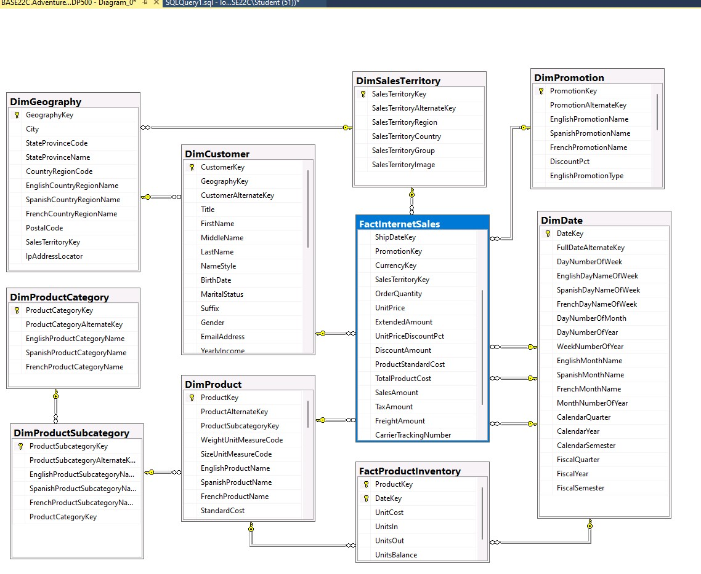

# Repo description:

#### -This is a data warehouse OLAP system created from distributed OLTP system. 
#### -The DW **Snowflake schema** in the ER diagram shows the dependent dimensions.
#### -The OLAP **dimensional Star schema** has a fact table with composite primary key consist of (orderId, ItemId)

 

This **repo** contains:
* Generated dimension date table by TSQL
* TSQL queries that define the **star schema**.
* ER diagram for Star and **Snowflake models.**
* Ad-hoc queries for data discovery.
* **Stored Procedure** and Views for advanced insights.
* **UAT Quality** for data Validity, accuracy and integrity.
* **Copy pipeline** to copy tables from SQL server to Parquet in ADLS.
* Power BI report for revenue by region, Year and month for each Product-category.

 

 

